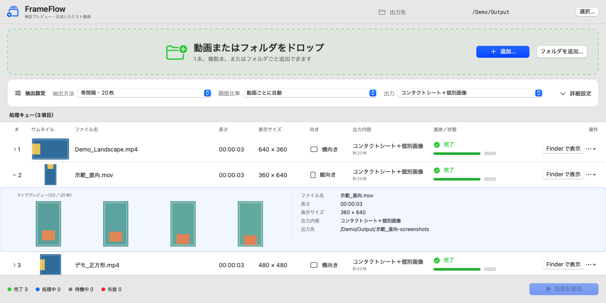
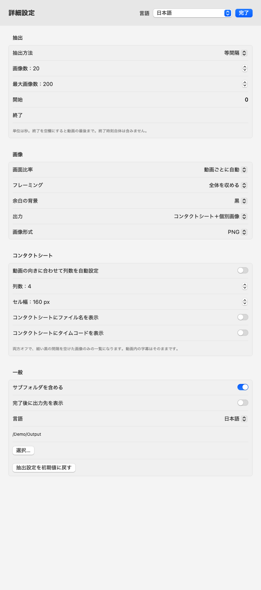
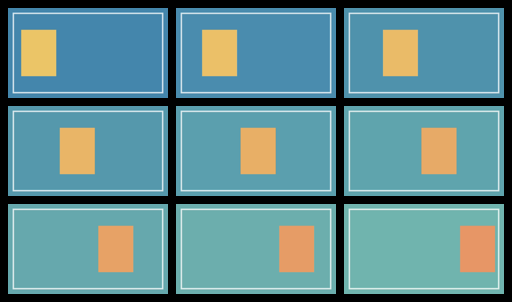

# FrameFlow

[English](README.md) · [繁體中文](README.zh-Hant.md) · [日本語](README.ja.md)

Mac 上で動画をコンタクトシートや個別のスクリーンショットに。

動画を 1 本、複数本、またはフォルダごとドロップ。抽出枚数とレイアウトを選び、コンタクトシート、個別画像、または両方を出力できます。処理はすべてローカルで行われ、アカウント、クラウドサービス、Obsidian、FFmpeg の追加インストールは不要です。



画面と出力例には、合成したデモ動画と架空のファイルパスを使用しています。

## 主な機能

- 動画とフォルダの一括処理。サブフォルダを含めるか選択可能。
- 枚数を指定する等間隔抽出、固定秒数ごとの抽出、手動での時刻指定。
- 動画ごとの画面比率と回転情報の自動判定。横向き・縦向きの混在に対応。
- コンタクトシートの列数を指定可能。ファイル名とタイムコードは個別に切り替えられ、**初期設定では両方オフ**。
- JPEG・PNG 出力、ライブプレビュー、一時停止・再開、項目単位の停止、再試行。
- 英語・繁体字中国語・日本語の表示。システム言語への追従と手動切り替えに対応。

## 動作環境とインストール

**バージョン 0.2.2 プレビュー版 · macOS 14 以降 · Apple Silicon（arm64）。** Intel ビルドは未検証です。

`FrameFlow-0.2.2-macos-arm64.zip` を展開し、`FrameFlow.app` を「アプリケーション」など任意のフォルダへ移動してください。

現在のビルドは ad-hoc 署名で、Developer ID 署名・公証は行っていません。初回起動時に macOS がブロックしたり、警告を表示したりする場合があります。信頼できるコピーだけを開き、システムの保護は無効にしないでください。

## 使い方

1. FrameFlow を開き、「選択…」で出力フォルダを指定します。
2. 緑の領域へ動画やフォルダをドロップするか、「追加…／フォルダを追加」を押します。初期設定ではサブフォルダも含まれます。
3. 「詳細設定」で抽出方法、画像数、画面比率、画像形式、シートのレイアウトを選びます。
4. 「処理を開始」を押します。各項目を展開するとプレビューと詳細を確認できます。
5. 完了後は「Finder で表示」で出力を開けます。

一括処理は全体の一時停止・再開・停止に対応しています。項目単位の停止ボタンでは現在の項目だけを止められます。失敗・キャンセルした項目は再試行でき、完了済みの出力は保持されます。キューから項目を削除しても元の動画は削除されません。

## コンタクトシートのレイアウト

「詳細設定 → コンタクトシート」で「動画の向きに合わせて列数を自動設定」をオフにすると、「列数」が表示されます。増減ボタンで **1～10 列**を選び、「抽出」セクションで「画像数」を別途設定します。行数は自動計算されます。

| 画像数 | 列数 | レイアウト（列 × 行） | 横向き | 縦向き |
|---|---|---|---|---|
| 9 枚 | 3 | 3 × 3 | [例](docs/images/sheet-3x3-landscape.png) | [例](docs/images/sheet-3x3-portrait.png) |
| 20 枚 | 4 | 4 × 5 | [例](docs/images/sheet-4x5-landscape.png) | [例](docs/images/sheet-4x5-portrait.png) |
| 18 枚 | 3 | 3 × 6 | [例](docs/images/sheet-3x6-landscape.png) | [例](docs/images/sheet-3x6-portrait.png) |

これらは設定例であり、プリセットや選択肢の制限ではありません。最後の行が埋まらない場合は左寄せになり、同じ画像を繰り返して埋めることはありません。画像数が列数より少ない場合は、必要な列だけを使います。自動設定では横向き・正方形は最大 5 列、縦向きは最大 3 列です。

[列数の自動設定がオンの画面を見る](docs/images/settings-auto-ja.png)



「コンタクトシートにファイル名を表示」と「コンタクトシートにタイムコードを表示」は個別に切り替えられ、**初期設定では両方オフ**です。両方オフにすると、細い黒の間隔を空けて画像だけを並べます。動画に元からある字幕や文字はそのまま表示されます。個別画像のファイル名には連番とタイムコードが入ります。



## 抽出と出力の設定

- **等間隔**：選択範囲から 1～200 枚を均等に抽出します。範囲の開始・終了時刻そのものは避けます。
- **固定間隔**：指定秒数ごとに抽出します。「最大画像数」が上限です。
- **手動時刻**：秒数または `HH:MM:SS.sss` をカンマや改行で区切って入力します。時刻は並べ替えられ、重複は除外されます。
- **開始／終了**：単位は秒です。終了を空欄にすると動画の最後までが対象ですが、終了時刻そのものは含みません。「最大画像数」は等間隔・手動モードにも適用されます。
- **動画ごとに自動**：各動画の表示比率と回転情報を保持します。
- **固定比率**：16:9、9:16、4:3、3:4、1:1。「全体を収める」は余白を追加し、切り抜きモードは中央をトリミングします。縦横を引き伸ばしません。
- **出力**：コンタクトシート、個別画像、または両方。品質を調整できる JPEG と PNG から選択できます。セル幅は 120～640 px、シート全体が 8,000 万画素を超える場合は生成できません。
- **項目別設定**：待機中の項目には一括設定とは異なる設定を適用できます。処理開始済みのジョブは変更されません。

動画ごとに出力フォルダを作成します。以下はその一例です。

```text
Demo_Landscape-screenshots/
  Demo_Landscape-contact-sheet.jpg
  frames/
    Demo_Landscape-0001-00-00-00.143.jpg
  run-report.json
```

内容は出力選択と形式によって変わります。同名フォルダがある場合は番号付きの別フォルダを作り、上書きしません。中断した出力は独立した隠し `.incomplete-` フォルダに残り、アプリが自動削除することはありません。再試行では新しい出力を作成します。

## 表示言語

「詳細設定」またはアプリの設定画面で「システムに従う／English／繁體中文／日本語」を選択できます。システムに従う場合は最優先のシステム言語を使い、非対応なら英語になります。ファイル名や動画内容は翻訳されません。

バージョンと作者表記は「FrameFlow → FrameFlow について」で確認できます。

## プライバシー

動画はローカルで処理されます。FrameFlow にテレメトリー、ログイン、アップロード機能はなく、元の動画も変更しません。出力先と設定はローカルに保存しますが、前回の動画キューは保存しません。

**生成される `run-report.json` には、元動画のフルパス、ファイル名、設定、抽出時刻が含まれます。** レポートや画像を共有する前に確認してください。クラウド同期フォルダを出力先に選ぶと、その同期サービスが FrameFlow とは別にファイルをアップロードする場合があります。

## 互換性と既知の制限

- 対応可否は拡張子だけでなく macOS AVFoundation のデコード能力に依存します。MP4、MOV、M4V、AVI、MKV、WebM、MTS、M2TS、MXF を入力候補として認識しますが、すべてのコンテナ・コーデックに対応するわけではありません。
- 現在はプレビュー版です。H.264 の横向き動画と 90° 回転情報付きの縦向き動画は検証済みですが、HEVC、HDR、可変フレームレート、270° 回転、長時間・4K 動画、大量ファイルの互換性は全面的には検証していません。
- **Command-Period は処理全体を停止します。** 1 項目だけ止める場合は項目単位の停止ボタンを使ってください。
- 一部の数値表示は完全にはローカライズされておらず、失敗したジョブの構造化エラーレポートは保存されません。

## ソースからビルド

Apple の Xcode コマンドラインツール、Swift 5.10 以降、macOS SDK が必要です。サードパーティーのパッケージは不要です。

リポジトリのルートから実行します。

```sh
bash scripts/package-app.sh build-output/local-01 build-scratch/release-01
```

ad-hoc 署名の `build-output/local-01/FrameFlow.app` が生成されます。引数の 2 つのディレクトリは、どちらもまだ存在しないパスを指定してください。再ビルド時は別の名前を使います。

ユニットテストを実行するには：

```sh
FRAMEFLOW_RESOURCE_ROOT="$PWD/Sources/FrameFlowUI/Resources" \
FRAMEFLOW_TEST_ROOT="$PWD/test-output/unit-01" \
swift test --scratch-path build-scratch/tests-01
```

## ライセンス

現在、ソースコードとアイコンにオープンソースライセンスは付与されていません。
