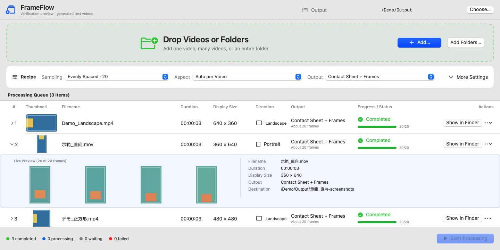
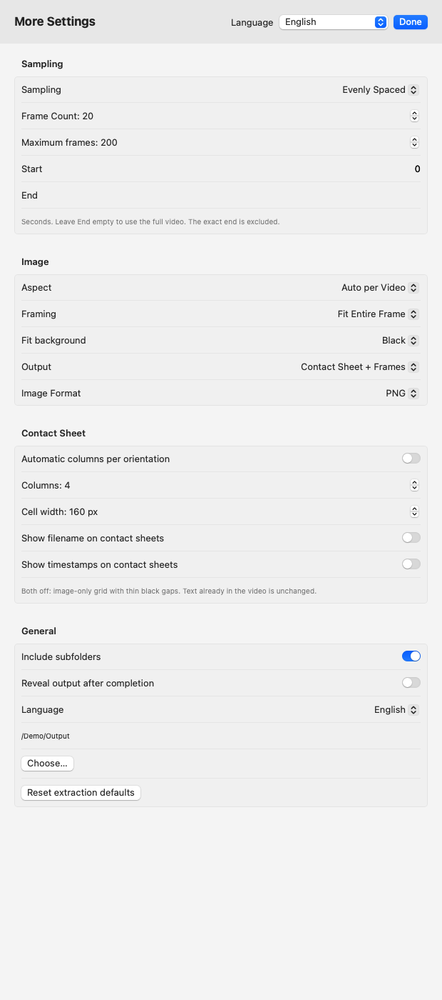

# FrameFlow

[English](README.md) · [繁體中文](README.zh-Hant.md) · [日本語](README.ja.md)

Turn videos into contact sheets and individual screenshots — right on your Mac.

Drag in a video, a batch of videos, or a folder. Choose how many frames to capture, arrange them in a grid, and export a contact sheet, individual images, or both. FrameFlow runs locally, with no account, cloud service, Obsidian, or separate FFmpeg installation required.



Screenshots and examples use synthetic demo videos and fictional file paths.

## Features

- Batch processing for videos and folders, with optional subfolder scanning.
- Evenly spaced frames, fixed intervals, or manually selected timestamps.
- Automatic aspect ratio and rotation handling for each video, including mixed portrait and landscape batches.
- Custom contact-sheet columns, with filename and timestamp labels independently optional and **off by default**.
- JPEG and PNG output, live previews, pause/resume, item cancellation, and retry.
- English, Traditional Chinese, and Japanese interfaces, with system-language or manual selection.

## Requirements and installation

**Version 0.2.2 preview · macOS 14 or later · Apple Silicon (arm64).** Intel builds have not been tested.

Extract `FrameFlow-0.2.2-macos-arm64.zip`, then move `FrameFlow.app` into Applications or another folder of your choice.

The current build is ad-hoc signed, not Developer ID signed or notarized. macOS may block or warn about it on first launch. Only open a copy you trust; do not disable system security.

## Quick start

1. Open FrameFlow and use **Choose…** to select an output folder.
2. Drag videos or folders into the green area, or use **Add… / Add Folders…**. Subfolders are included by default.
3. Open **More Settings** to choose sampling, frame count, aspect ratio, image format, and sheet layout.
4. Click **Start Processing**. Expand a row to see previews and details.
5. When finished, choose **Show in Finder**.

Use **Pause All**, **Continue**, or **Stop All** to control a batch. **Stop Item** stops only the current item. Failed or canceled items can be retried, and completed output is kept. Removing an item from the queue does not delete its source video.

## Contact-sheet layout

In **More Settings → Contact Sheet**, turn **Automatic columns per orientation** off to reveal **Columns**. Choose **1–10 columns** using the stepper, and set **Frame Count** separately in the Sampling section. Rows are calculated automatically.

| Frames | Columns | Layout (columns × rows) | Landscape | Portrait |
|---|---|---|---|---|
| 9 | 3 | 3 × 3 | [Example](docs/images/sheet-3x3-landscape.png) | [Example](docs/images/sheet-3x3-portrait.png) |
| 20 | 4 | 4 × 5 | [Example](docs/images/sheet-4x5-landscape.png) | [Example](docs/images/sheet-4x5-portrait.png) |
| 18 | 3 | 3 × 6 | [Example](docs/images/sheet-3x6-landscape.png) | [Example](docs/images/sheet-3x6-portrait.png) |

These are examples, not presets or the only available layouts. An incomplete last row stays left-aligned without repeating frames. If there are fewer frames than columns, only the necessary columns are used. Automatic layout uses up to five columns for landscape/square frames and up to three for portrait frames.

[View settings with automatic layout enabled](docs/images/settings-auto-en.png)



**Show filename on contact sheets** and **Show timestamps on contact sheets** are independent switches, both off by default. Leave both off for an image-only grid with thin black gaps. Subtitles or text already in the video remain visible; individual image filenames still include a sequence number and timestamp.


## Capture and export options

- **Evenly Spaced:** capture 1–200 frames across the selected range, avoiding the exact start and end.
- **Fixed Interval:** capture every specified number of seconds, up to **Maximum frames**.
- **Manual Times:** enter seconds or `HH:MM:SS.sss`, separated by commas or new lines. Times are sorted and duplicates removed.
- **Start / End:** enter seconds; leave End empty to use the video end. The exact end is excluded. Maximum frames also caps evenly spaced and manual sampling.
- **Auto per Video:** preserve each video's displayed aspect ratio and rotation.
- **Fixed aspects:** 16:9, 9:16, 4:3, 3:4, or 1:1. **Fit Entire Frame** adds margins; **Fill and Crop** crops the center without stretching.
- **Output:** contact sheet, individual frames, or both. Choose JPEG with adjustable quality or PNG. Sheet cell width is 120–640 px; sheets above 80 megapixels cannot be generated.
- **Per-video settings:** waiting items can override the batch settings through **Item Settings**. Changes do not alter a job already being processed.

Each video gets its own output folder. For example:

```text
Demo_Landscape-screenshots/
  Demo_Landscape-contact-sheet.jpg
  frames/
    Demo_Landscape-0001-00-00-00.143.jpg
  run-report.json
```

Contents depend on the selected output and format. Existing destinations are not overwritten: FrameFlow creates a new numbered folder instead. Interrupted output remains in separate hidden `.incomplete-` folders, which the app does not remove automatically. Retrying creates a new run.

## Language

Choose **Follow System / English / 繁體中文 / 日本語** in More Settings or the app's Settings window. Follow System uses the first preferred system language and falls back to English if it is unsupported. Filenames and video content are never translated.

The version and author credit are available in **FrameFlow → About FrameFlow**.

## Privacy

Videos are processed locally. FrameFlow has no telemetry, login, or upload feature, and does not modify source videos. Output location and settings are saved locally; the previous video queue is not saved.

**Generated `run-report.json` files contain the source video's full path, filename, settings, and capture times.** Review reports and images before sharing them. If your output folder is cloud-synced, its sync service may upload the files independently of FrameFlow.

## Compatibility and known limitations

- Decoding depends on macOS AVFoundation, not just the file extension. FrameFlow recognizes MP4, MOV, M4V, AVI, MKV, WebM, MTS, M2TS, and MXF as input candidates, but not every container or codec is supported.
- This is a preview release. H.264 landscape and 90°-rotated portrait media have been tested; compatibility with HEVC, HDR, variable frame rates, 270° rotation, long/4K videos, and very large batches has not been fully verified.
- **Command-Period stops the entire batch.** Use **Stop Item** to stop only one item.
- Some numeric summaries are not fully localized, and failed runs do not save a structured error report.

## Build from source

Requires Apple's Xcode command-line tools, Swift 5.10 or later, and the macOS SDK. No third-party packages are required.

From the repository root:

```sh
bash scripts/package-app.sh build-output/local-01 build-scratch/release-01
```

The app is created at `build-output/local-01/FrameFlow.app` with an ad-hoc signature. Both directory arguments must be new paths; use different names for subsequent builds.

Run unit tests:

```sh
FRAMEFLOW_RESOURCE_ROOT="$PWD/Sources/FrameFlowUI/Resources" \
FRAMEFLOW_TEST_ROOT="$PWD/test-output/unit-01" \
swift test --scratch-path build-scratch/tests-01
```

## License

No open-source license is currently granted for the source code or artwork.
