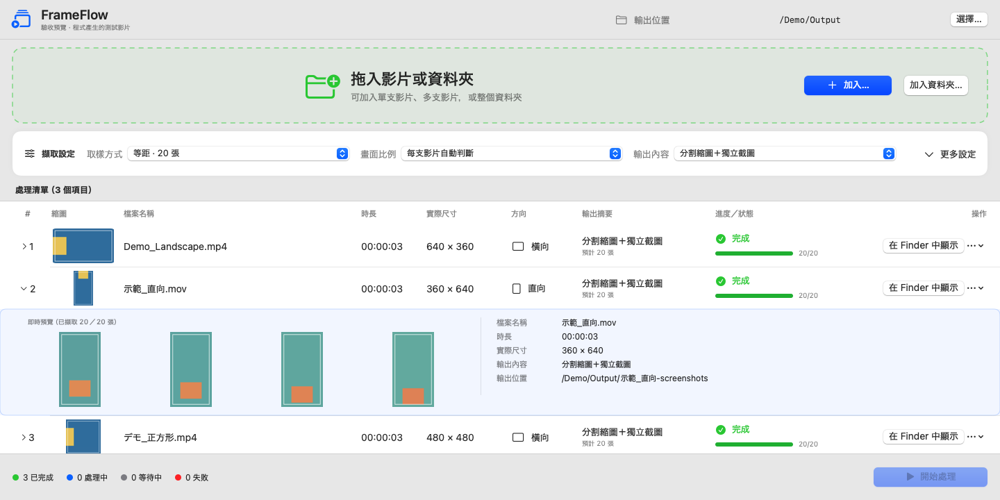
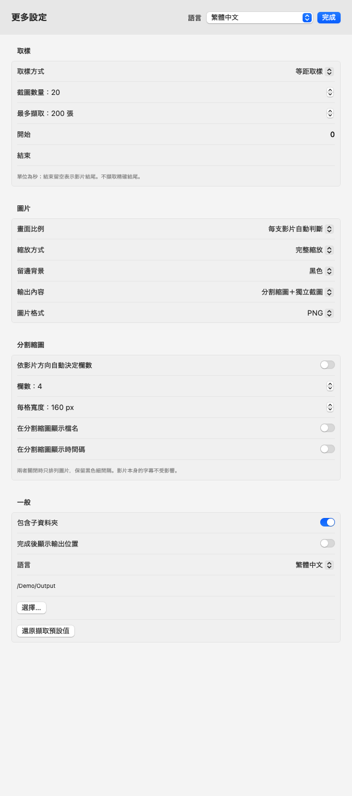

# FrameFlow

[English](README.md) · [繁體中文](README.zh-Hant.md) · [日本語](README.ja.md)

在 Mac 上，把影片轉成分割縮圖與獨立截圖。

拖入單支、多支影片或整個資料夾，選擇擷取張數與排列方式，即可輸出分割縮圖、獨立圖片，或兩者一起輸出。FrameFlow 完全在本機處理，不需要帳號、雲端服務、Obsidian 或另外安裝 FFmpeg。



介面截圖與範例使用合成示範影片及虛構檔案路徑。

## 功能

- 支援影片與資料夾批次處理，可選擇是否包含子資料夾。
- 依張數等距取樣、固定時間間隔，或手動指定時間點。
- 每支影片各自判斷比例與旋轉方向，可混合處理橫片與直片。
- 自訂分割縮圖欄數；檔名與時間碼可獨立切換，**預設皆關閉**。
- 支援 JPEG、PNG、即時預覽、暫停／繼續、單項停止與重試。
- 英文、繁體中文及日文介面，可跟隨系統或手動切換。

## 系統需求與安裝

**版本 0.2.2 預覽版 · macOS 14 以上 · Apple Silicon（arm64）。** Intel 建置尚未測試。

解壓縮 `FrameFlow-0.2.2-macos-arm64.zip`，將 `FrameFlow.app` 移至「應用程式」或其他想放置的資料夾。

目前採用 ad-hoc 簽章，沒有 Developer ID 簽章，也尚未公證。首次開啟時，macOS 可能阻擋或顯示警告。請只開啟你信任的副本，不要關閉系統安全保護。

## 快速開始

1. 開啟 FrameFlow，按「選擇…」指定輸出資料夾。
2. 把影片或資料夾拖入綠色區域，或按「加入…／加入資料夾」。預設包含子資料夾。
3. 開啟「更多設定」，選擇取樣方式、截圖張數、畫面比例、圖片格式及分割縮圖排列。
4. 按「開始處理」。展開項目可查看預覽及詳細資訊。
5. 完成後按「在 Finder 中顯示」。

整批可使用「暫停全部／繼續／停止全部」；「停止此項目」只停止目前項目。失敗或取消的項目可重試，已完成輸出會保留。移除佇列項目不會刪除來源影片。

## 分割縮圖排列

到「更多設定 → 分割縮圖」，關閉「依影片方向自動決定欄數」，就會出現「欄數」。使用增減按鈕選擇 **1～10 欄**，再於「取樣」區設定「截圖數量」。列數會自動計算。

| 擷取張數 | 欄數 | 排列（欄 × 列） | 橫片 | 直片 |
|---|---|---|---|---|
| 9 張 | 3 | 3 × 3 | [範例](docs/images/sheet-3x3-landscape.png) | [範例](docs/images/sheet-3x3-portrait.png) |
| 20 張 | 4 | 4 × 5 | [範例](docs/images/sheet-4x5-landscape.png) | [範例](docs/images/sheet-4x5-portrait.png) |
| 18 張 | 3 | 3 × 6 | [範例](docs/images/sheet-3x6-landscape.png) | [範例](docs/images/sheet-3x6-portrait.png) |

這些只是例子，不是限定的預設組合。最後一列不足時會靠左排列，不會重複圖片補滿；圖片少於設定欄數時，只使用需要的欄數。自動排列模式中，橫向／正方形最多 5 欄，直向最多 3 欄。

[查看開啟自動排列時的設定畫面](docs/images/settings-auto-zh-Hant.png)



「在分割縮圖顯示檔名」與「在分割縮圖顯示時間碼」可獨立切換，**預設皆關閉**。兩者關閉時只排列圖片，保留黑色細間隔。影片原有的字幕或文字仍會顯示；獨立截圖的檔名仍包含序號與時間碼。


## 擷取與輸出選項

- **等距取樣**：在選定範圍平均擷取 1～200 張，避開精確起點與終點。
- **固定間隔**：每隔指定秒數擷取，受到「最多擷取」張數限制。
- **手動時間點**：輸入秒數或 `HH:MM:SS.sss`，以逗號或換行分隔；會排序並去除重複時間點。
- **開始／結束**：單位為秒，結束留空代表影片結尾，不擷取精確結尾。「最多擷取」也會限制等距及手動模式。
- **每支影片自動判斷**：保留各支影片的實際顯示比例與旋轉方向。
- **固定比例**：16:9、9:16、4:3、3:4 或 1:1。「完整縮放」可留邊；「填滿裁切」置中裁切，不拉伸。
- **輸出**：分割縮圖、獨立截圖或兩者；可選擇可調品質的 JPEG 或 PNG。縮圖每格寬度為 120～640 px；整張超過 8,000 萬像素時無法產生。
- **單項設定**：等待中的項目可使用個別設定，取代整批設定；不會改變已在處理中的工作。

每支影片會建立獨立輸出資料夾，例如：

```text
Demo_Landscape-screenshots/
  Demo_Landscape-contact-sheet.jpg
  frames/
    Demo_Landscape-0001-00-00-00.143.jpg
  run-report.json
```

內容依輸出選項及格式而異。遇到同名資料夾時會建立帶編號的新資料夾，不覆寫。中斷的輸出保留於獨立、隱藏的 `.incomplete-` 資料夾，App 不會自動刪除；重試會建立新一輪輸出。

## 語言

在「更多設定」或 App 的設定視窗選擇「跟隨系統／English／繁體中文／日本語」。「跟隨系統」使用第一個系統偏好語言，不支援時使用英文。檔名及影片內容不會被翻譯。

版本與作者署名可在「FrameFlow → 關於 FrameFlow」查看。

## 隱私

影片在本機處理。FrameFlow 沒有遙測、登入或上傳功能，也不修改來源影片。輸出位置及偏好設定儲存於本機，不保存上一批影片清單。

**產生的 `run-report.json` 包含來源影片完整路徑、檔名、設定及擷取時間點。** 分享報告或圖片前請先檢查。如果輸出位置是雲端同步資料夾，其同步服務仍可能自行上傳檔案。

## 相容性與已知限制

- 能否解碼取決於 macOS AVFoundation，不只取決於副檔名。FrameFlow 會將 MP4、MOV、M4V、AVI、MKV、WebM、MTS、M2TS、MXF 識別為候選輸入，但不是所有容器與編碼都能讀取。
- 目前為預覽版。已測試 H.264 橫片及旋轉 90° 的直片；HEVC、HDR、可變幀率、270° 旋轉、長片／4K 影片與大量檔案的相容性尚未完整驗證。
- **Command-Period 會停止整批**；只要停止單項時，請使用「停止此項目」。
- 部分數字摘要尚未完整依語系格式化；失敗的工作不會保存結構化錯誤報告。

## 從原始碼建置

需要 Apple Xcode 命令列工具、Swift 5.10 以上及 macOS SDK，不需要第三方套件。

在專案根目錄執行：

```sh
bash scripts/package-app.sh build-output/local-01 build-scratch/release-01
```

會產生採用 ad-hoc 簽章的 `build-output/local-01/FrameFlow.app`。兩個目錄參數都必須是尚不存在的新路徑；再次建置時請使用不同名稱。

執行單元測試：

```sh
FRAMEFLOW_RESOURCE_ROOT="$PWD/Sources/FrameFlowUI/Resources" \
FRAMEFLOW_TEST_ROOT="$PWD/test-output/unit-01" \
swift test --scratch-path build-scratch/tests-01
```

## 授權

目前未對原始碼或圖示授予開源授權。
